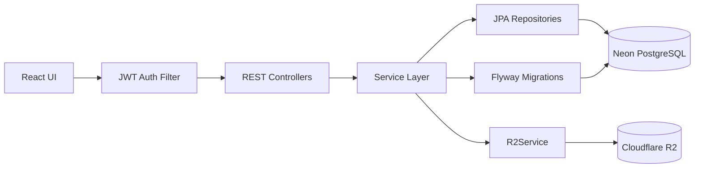
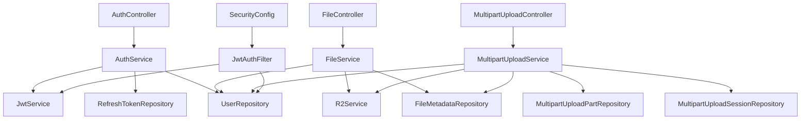
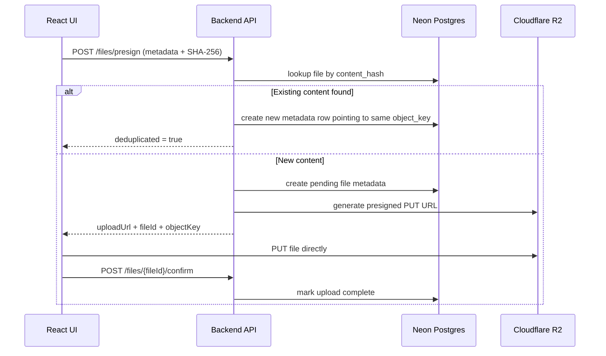
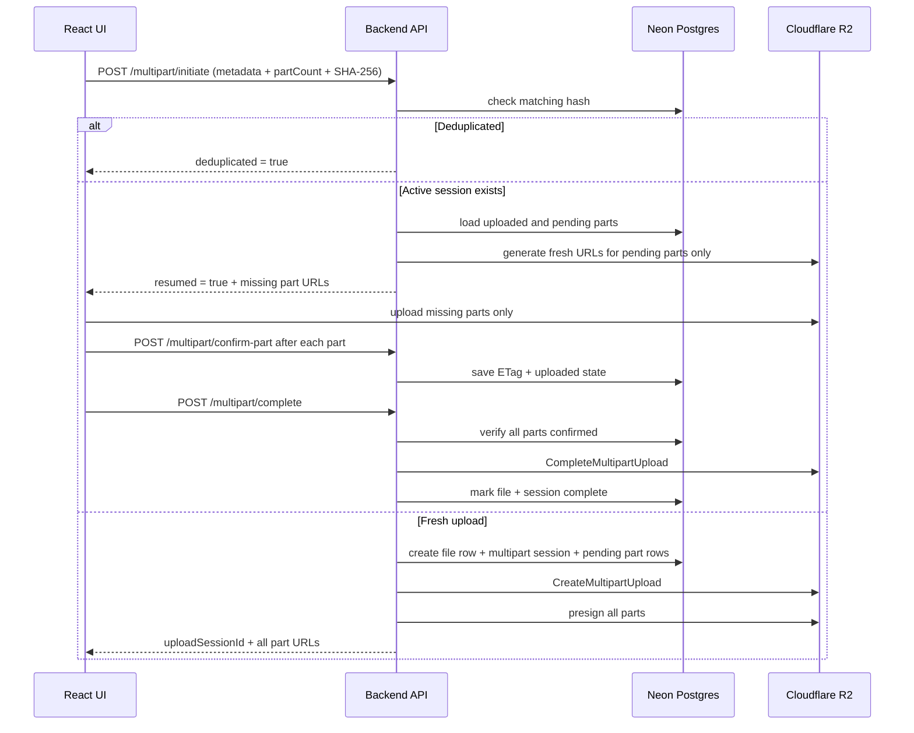

# Dropbox Clone Backend

Spring Boot backend for a Dropbox-like file storage system built around JWT authentication, presigned Cloudflare R2 uploads/downloads, resumable multipart uploads, and SHA-256 based deduplication.

## Overview

This service acts as the control plane for file storage:

- authenticates users with access tokens and rotating refresh tokens
- stores user, file, refresh-token, and multipart metadata in **Neon PostgreSQL**
- generates presigned **Cloudflare R2** URLs for direct browser upload and download
- coordinates multipart upload sessions and tracks uploaded parts for resume support
- deduplicates uploads by content hash so identical files reuse the same object key
- exposes Swagger/OpenAPI docs for API exploration

The backend does **not** proxy file bytes during normal upload/download. File data flows directly between the client and R2 using presigned URLs.

## Core Features

- **JWT authentication** with BCrypt password hashing
- **Refresh-token rotation** with hashed refresh tokens stored in Postgres
- **Direct single-part upload** with presigned PUT URLs
- **Direct download** with presigned GET URLs
- **Multipart upload orchestration** for large files
- **Resume support** using persisted part status + ETags
- **Content deduplication** using SHA-256 hashes from the client
- **Soft delete** for file records
- **Flyway migrations** for schema evolution
- **Swagger UI** for API documentation

## Architecture

### System architecture



### Backend component view



### Single-file upload / dedup flow



### Multipart resume flow



## Tech Stack

- **Java 17**
- **Spring Boot 3.5**
- **Spring Security**
- **Spring Data JPA**
- **PostgreSQL / Neon**
- **Flyway**
- **JWT (jjwt)**
- **AWS SDK v2 S3 client/presigner** for Cloudflare R2
- **springdoc OpenAPI**

## Main Modules

### Authentication

- `AuthController` handles register, login, refresh, and logout.
- `AuthService` creates users, validates credentials, rotates refresh tokens, and generates access tokens.
- `JwtAuthFilter` validates Bearer tokens and attaches the authenticated user to the Spring Security context.
- Refresh tokens are stored as **SHA-256 hashes**, not raw tokens.

### File upload / download

- `FileController` handles single-part presign, upload confirmation, listing, download URL generation, and soft delete.
- `FileService` stores file metadata and applies single-file deduplication.
- `R2Service` generates presigned PUT/GET URLs and manages multipart operations.

### Multipart upload

- `MultipartUploadController` exposes initiate, presign-part, confirm-part, complete, and abort endpoints.
- `MultipartUploadService` drives three outcomes during initiate:
  - deduplicate existing content
  - resume an interrupted upload
  - create a fresh multipart session
- Each uploaded part is stored in `multipart_upload_parts` with part number, ETag, status, size, and timestamps.

## Data Model

Main persisted entities:

- `users`
- `files`
- `refresh_tokens`
- `multipart_upload_sessions`
- `multipart_upload_parts`
- `folders` table exists in schema, though the primary implemented backend flows in this repo focus on auth and file storage operations

### Storage responsibilities

- **Neon Postgres** stores metadata only
- **Cloudflare R2** stores the actual file bytes
- **Object key pattern**: `ownerId/fileId/originalName`

## API Summary

### Public endpoints

- `POST /api/v1/auth/register`
- `POST /api/v1/auth/login`
- `POST /api/v1/auth/refresh`
- `POST /api/v1/auth/logout`
- `GET /api/v1/health`
- `GET /swagger-ui.html`

### Protected endpoints

- `POST /api/v1/files/presign`
- `POST /api/v1/files/{fileId}/confirm`
- `GET /api/v1/files`
- `DELETE /api/v1/files/{fileId}`
- `GET /api/v1/files/{fileId}/download`
- `POST /api/v1/multipart/initiate`
- `POST /api/v1/multipart/presign-part`
- `POST /api/v1/multipart/confirm-part`
- `POST /api/v1/multipart/complete`
- `POST /api/v1/multipart/abort`

## Environment Variables

The backend reads configuration from `application.properties` plus environment variables.

| Variable        | Purpose                           |
| --------------- | --------------------------------- |
| `SERVER_PORT`   | API port, defaults to `8080`      |
| `NEON_USERNAME` | Neon Postgres username            |
| `NEON_PASSWORD` | Neon Postgres password            |
| `JWT_SECRET`    | JWT signing key                   |
| `R2_ACCOUNT_ID` | Cloudflare account id             |
| `R2_ACCESS_KEY` | R2 access key                     |
| `R2_SECRET_KEY` | R2 secret key                     |
| `R2_BUCKET`     | R2 bucket name                    |
| `R2_DURATION`   | presigned URL duration in minutes |

## Local Development

### Prerequisites

- Java **17**
- Maven **3.9+**
- Neon Postgres database
- Cloudflare R2 bucket

### Run locally

```bash
mvn spring-boot:run
```

Default local port: `http://localhost:8080`

### Swagger UI

Open:

```text
http://localhost:8080/swagger-ui.html
```

### Health check

```text
http://localhost:8080/api/v1/health
```

## Docker

A multi-stage Dockerfile is included.

### Build image

```bash
docker build -t dropbox-backend .
```

### Run container

```bash
docker run -p 8080:8080 \
  -e SERVER_PORT=8080 \
  -e NEON_USERNAME=your_neon_username \
  -e NEON_PASSWORD=your_neon_password \
  -e JWT_SECRET=your_jwt_secret \
  -e R2_ACCOUNT_ID=your_r2_account_id \
  -e R2_ACCESS_KEY=your_r2_access_key \
  -e R2_SECRET_KEY=your_r2_secret_key \
  -e R2_BUCKET=your_bucket \
  -e R2_DURATION=15 \
  dropbox-backend
```

## Database Migrations

Flyway migrations currently cover:

- initial users / folders / files schema
- username support on users
- refresh tokens
- soft delete on files
- multipart session tracking
- file content hash for deduplication
- multipart part tracking
- session part count for resume correctness

## Security Notes

- access tokens are short-lived JWTs
- refresh tokens are stored in an **HttpOnly, Secure, SameSite=Strict** cookie
- refresh token values are hashed before persistence
- passwords are stored using **BCrypt**
- protected endpoints require a valid Bearer token
- CORS is currently configured for localhost, ngrok, and the deployed Vercel frontend

## Future Plans

- add **rate limiting** for daily upload count and total uploaded bytes
- add **per-user quotas** and billing-safe storage caps
- add **cleanup jobs** for stale multipart sessions and orphaned objects
- add **email verification** and password reset flows
- add **shared links** and permissioned file sharing
- add **server-backed folder APIs** and move/rename support
- add **observability** with metrics, traces, and alerting
- add **background malware scanning** and content validation
- add **lifecycle management** for soft-deleted files to control storage costs
- add **audit logs** for security-sensitive actions
