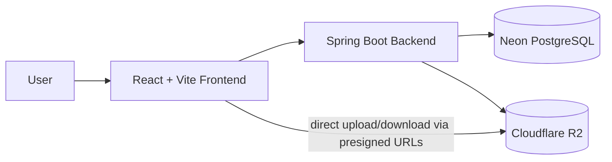
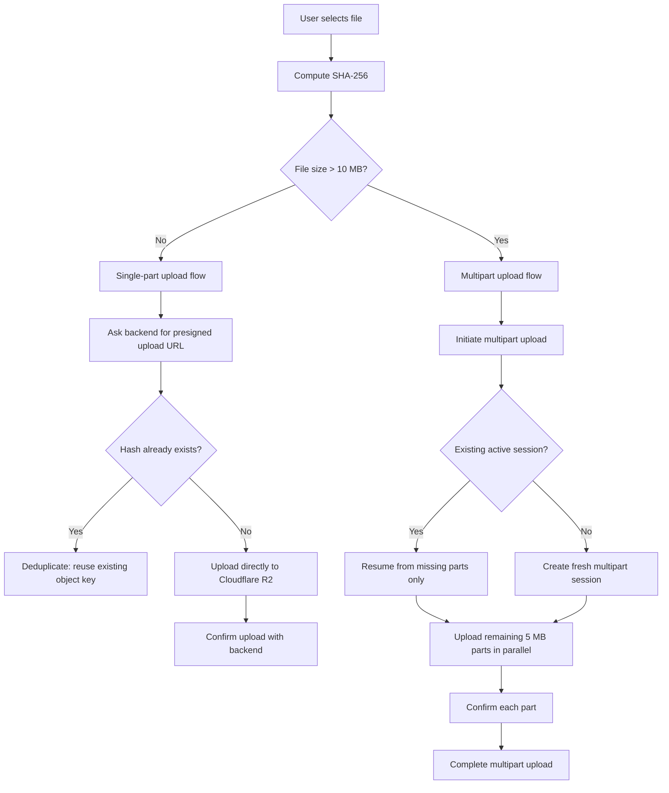
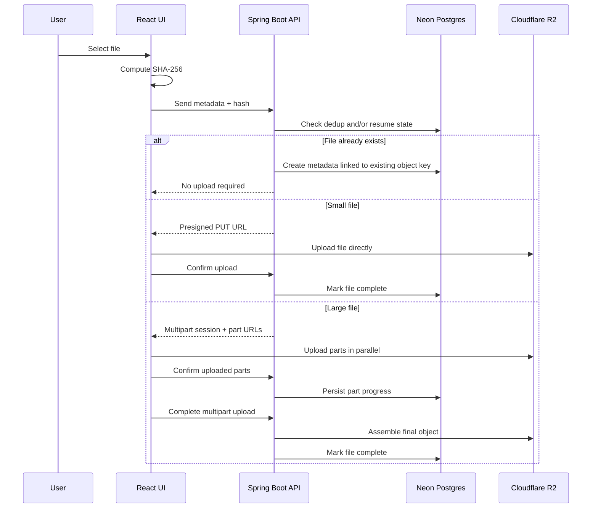

# Dropbox Clone

A full-stack Dropbox-like file storage system built with **React + Vite** on the frontend and **Java Spring Boot** on the backend.

This project focuses on efficient file upload/download workflows with:

- user authentication
- direct browser-to-cloud uploads
- multipart uploads for large files
- resumable uploads after interruption or client crash
- SHA-256 based deduplication
- Neon Postgres metadata storage
- Cloudflare R2 object storage

## Repositories

- [React UI](React%20UI/README.md) — frontend built with React and Vite
- [Backend](Backend/README.md) — Spring Boot API, auth, metadata, multipart orchestration, and presigned URL generation

## What This Project Does

This system is designed like a lightweight Dropbox-style file platform:

- users sign up and log in
- users upload and download files through the web app
- files larger than **10 MB** are uploaded as multipart uploads
- multipart uploads use **5 MB chunks** and upload parts in parallel
- if the client crashes or disconnects mid-upload, the upload can resume from the parts already uploaded
- duplicate content is not uploaded again if the same SHA-256 hash already exists

The actual file bytes are stored in **Cloudflare R2**, while **Neon Postgres** stores application metadata such as users, files, refresh tokens, multipart sessions, and uploaded parts.

## Architecture

### High-level architecture



### Upload architecture



### End-to-end sequence



## Main Features

### Authentication

- user registration and login
- JWT-based access tokens
- refresh token rotation using secure HttpOnly cookies
- protected backend APIs

### Upload / Download

- direct uploads to Cloudflare R2 using presigned URLs
- direct downloads from Cloudflare R2 using presigned URLs
- upload progress handling in the UI
- cancel support during upload

### Multipart Uploads

- files larger than **10 MB** use multipart upload
- every part is **5 MB** except the final smaller remainder
- parts are uploaded in parallel for better throughput
- uploaded part metadata is stored in Postgres
- interrupted uploads can resume by skipping already uploaded parts

### Deduplication

- deduplication is based on **SHA-256** content hashes
- hashing starts before upload
- large-file hashing runs inside a **Web Worker** so the main UI thread stays responsive
- if the backend already has the same content hash, the system creates a new metadata record mapped to the existing stored object instead of uploading again

## Tech Stack

### Frontend

- React 19
- Vite 7
- CSS Modules
- hash-wasm
- Web Workers

### Backend

- Java 17
- Spring Boot 3.5
- Spring Security
- Spring Data JPA
- Flyway
- JWT (jjwt)
- AWS SDK v2 S3 client/presigner for Cloudflare R2

### Infrastructure

- Neon PostgreSQL
- Cloudflare R2
- Docker for backend containerization

## Project Structure

```text
DropBox/
  Backend/
    README.md
    src/
    pom.xml
    Dockerfile
  React UI/
    README.md
    src/
    package.json
```

## How the Pieces Fit Together

- the **frontend** computes hashes, manages auth state, displays upload progress, and uploads directly to storage
- the **backend** authenticates users, stores metadata, checks deduplication, tracks multipart progress, and generates presigned URLs
- **Neon Postgres** is the metadata source of truth
- **Cloudflare R2** stores the actual file bytes

## Current Scope

What is already implemented in this project:

- auth flow
- file upload and download
- multipart uploads for large files
- resumable uploads after interruption
- deduplication using SHA-256
- metadata persistence in Neon Postgres
- object storage in Cloudflare R2

## Future Plans

- add **rate limiting** for daily upload count and total uploaded bytes
- add **per-user storage quotas** to control hobby-project cloud costs
- add **cleanup jobs** for stale multipart sessions and abandoned uploads
- add **server-backed folder APIs** and move/rename support
- add **file sharing** with expiring links and permissions
- add **search and filtering** for large file collections
- add **audit logs** and admin-level observability
- add **metrics, tracing, and alerts**
- add **malware/content scanning** before long-term retention
- add **lifecycle cleanup** for soft-deleted files

## Getting Started

For setup instructions, go to:

- [Frontend setup](React%20UI/README.md)
- [Backend setup](Backend/README.md)

## Notes

This root README is intended to be the GitHub landing page for the overall project, while each subproject README contains detailed setup and implementation notes.
