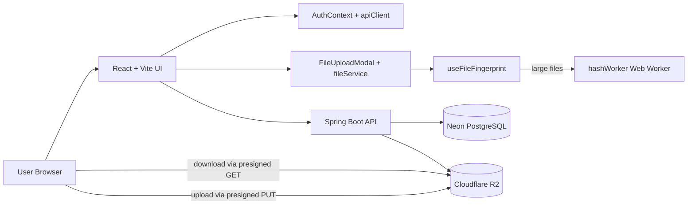
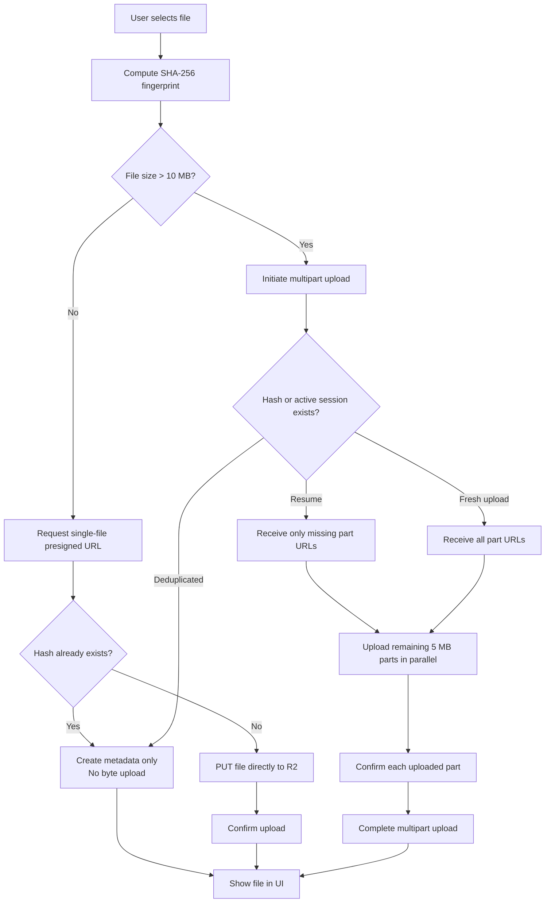
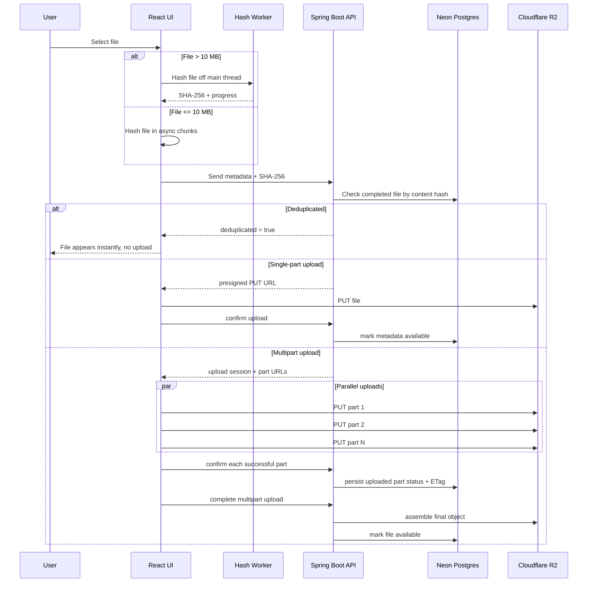

# Dropbox Clone UI

React + Vite frontend for a Dropbox-like file storage system with authentication, direct-to-object-storage uploads, resumable multipart uploads, and SHA-256 based deduplication.

## Overview

This UI is the control plane for the file upload experience:

- authenticates users against the Spring Boot backend
- computes SHA-256 file fingerprints before upload
- uses a Web Worker for large-file hashing to keep the UI responsive
- uploads small files with a single presigned URL
- uploads files larger than **10 MB** as **5 MB parts** in parallel
- resumes interrupted multipart uploads by skipping parts already confirmed on the server
- avoids re-uploading files when the same content hash already exists

The browser uploads file bytes directly to **Cloudflare R2**. The backend only handles auth, metadata, deduplication decisions, multipart coordination, and presigned URL generation.

## Key Features

- **Authentication** with access token + refresh token rotation
- **Direct upload/download** using presigned URLs
- **Multipart uploads** for files larger than 10 MB
- **Parallel chunk upload** with a concurrency limit of 6
- **Resume support** for interrupted multipart uploads
- **Deduplication** using SHA-256 content hashes
- **Responsive hashing** using a Web Worker for large files
- **Upload progress UI** with cancel support
- **Theme support** via React context

## Architecture

### High-level system view



### Client upload decision flow



### Upload sequence



## Tech Stack

- **React 19**
- **Vite 7**
- **CSS Modules**
- **hash-wasm** for SHA-256
- **Web Workers** for large-file hashing
- **Fetch API** for backend and presigned URL calls

## Important Implementation Details

### 1. Hashing and deduplication

- Files are fingerprinted with **SHA-256** before upload.
- Files larger than **10 MB** are hashed in `src/workers/hashWorker.js`.
- Smaller files are hashed in chunked async reads on the main thread.
- The hash is sent to the backend before upload starts.
- If the backend finds an existing file with the same content hash, it creates a new metadata record pointing to the same object key instead of uploading bytes again.

### 2. Multipart uploads

- Files larger than **10 MB** use multipart upload.
- Chunk size is fixed at **5 MB**.
- The client uploads parts with a concurrency limit of **6**.
- After every successful PUT, the UI confirms the part with the backend.
- On retry/restart, the backend returns only the missing part URLs and the UI skips already uploaded parts.

### 3. Authentication

- Access token is attached as a Bearer token for API requests.
- Refresh token is stored as an **HttpOnly cookie** by the backend.
- `src/utils/apiClient.js` refreshes the access token automatically when it is near expiry or when a request returns `401`.

## Project Structure

```text
src/
	components/
		Dashboard.jsx
		FileList.jsx
		FileUploadModal.jsx
		Header.jsx
		Login.jsx
		Signup.jsx
		UploadToast.jsx
	contexts/
		AuthContext.jsx
		ThemeContext.jsx
	hooks/
		useFileFingerprint.js
	services/
		authService.js
		fileService.js
	utils/
		apiClient.js
	workers/
		hashWorker.js
```

## Local Development

### Prerequisites

- Node.js **20+**
- npm
- running backend API

### Environment variables

Create a `.env` file:

```env
VITE_API_BASE_URL=http://localhost:8080/api/v1
```

### Install and run

```bash
npm install
npm run dev
```

The app runs on `http://localhost:5173` by default.

## Main User Flows

### Login / signup

1. User signs up or logs in.
2. Backend returns an access token in the response body.
3. Backend also sets a refresh token in a secure HttpOnly cookie.
4. UI stores lightweight user info and access-token expiry in local storage.

### Upload small file

1. Compute SHA-256.
2. Ask backend for a presigned upload URL.
3. If deduplicated, skip upload.
4. Otherwise PUT file directly to R2.
5. Confirm upload with backend.

### Upload large file

1. Compute SHA-256.
2. Call multipart initiate endpoint.
3. Backend either deduplicates, resumes, or creates a new multipart session.
4. Upload remaining 5 MB parts in parallel.
5. Confirm each uploaded part.
6. Complete multipart upload.

## Notes on Current Scope

- The upload and download pipeline is fully integrated with the backend.
- Folder state exists in the UI, but the core backend implementation in this repo is focused on auth, metadata, upload/download, deduplication, and multipart resume.
- Files are uploaded directly from the browser to R2; the backend does not proxy file bytes.

## Future Plans

- add **rate limiting** for daily upload count and total uploaded bytes
- add **user quota enforcement** backed by database counters
- add **background cleanup** for stale multipart sessions and abandoned metadata rows
- add **file sharing links** with scoped access and expiry
- add **server-backed folders** and move operations
- add **search, sort, and filtering** for large file libraries
- add **observability** with structured logs, metrics, and tracing
- add **virus scanning / content scanning** for uploaded files
- add **lifecycle rules** for deleted-file cleanup and storage cost control
- add **drag-and-drop uploads** and richer retry UX

## Backend Pairing

This frontend is designed to work with the Spring Boot backend in the sibling backend repository. The backend provides:

- JWT auth + refresh token rotation
- Neon Postgres metadata persistence
- Cloudflare R2 presigned upload/download URLs
- multipart session tracking and resume support
- SHA-256 deduplication lookups
